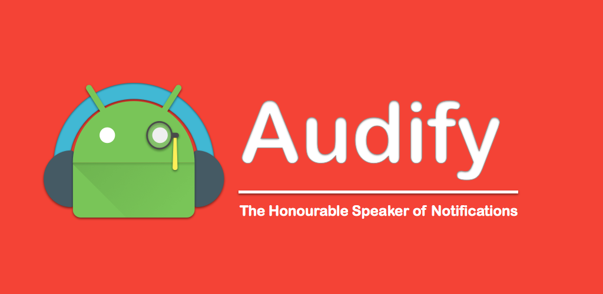

---

layout: post
firstPublishedAt: 1446832111474
latestPublishedAt: 1446972788812
slug: audify-version-1-00-idea-to-app-in-90-days
title: Audify Version 1.0 - Idea to App in 90 days - Part II

---

> [**Click here for Part I**](https://balachandarlinks.github.io/audify-version-1-0-idea-to-app-in-90-days-part-i/)

Started as a weekend exploration. But Audify quickly became a solid pet project and a playground to keep me engaged in my spare time.

> **Alpha Release**

Once I started adding features and fixing bugs, I wanted to roll them to my small group of brave volunteers (around 10 people) as soon as possible. What else can be the best way other than the Playstore alpha channel. I created a project for Audify in Playstore and released an alpha version (open to anyone via link).

> **Feature Loop**

It was so difficult for me to finalize the feature set for Version 1.0 which is the MVP of Audify as I keep finding more bells and whistles. But at one point I realised that I will never release the app, If I want to have “everything”. So I sat down and listed the features that are must and started to focus on completing them for release.

Anything that can help my users from annoying notifications were my top priority.

> **Architect the app for survival**

As we get into the excitement of developing a new app, It is quite frequent that we don’t care much about the code quality or a proper architecture for the app. Investing some time upfront is going to reap the benefits in releasing further updates. I learned it already with my first few apps. So I always spend time in keeping the code understandable. For example, One such place for Audify is the code which decides the fate of a Notification, Whether to read it or not. It has a number of important rules to process a Notification. Keeping it clean and simple, always helps me to not pull my hair and made it bug free as well.

> **Testing**

Audify isn’t fully covered by unit test cases. But I covered the important classes. For example, I have few classes, which process the incoming notifications and make them less annoying. Basically cutting short long notifications, replacing long http links etc. These classes are quite hard to test manually by passing every type of notification. So I covered them fully with unit test cases and made sure that they work as I expected.

As I started developing Audify for my own need, I always used Audify as a real user which helped me to fix lot of bugs and practical issues.

Audify has just one UI test case written using espresso and UIAutomator which tests the Enable Audify functionality 😱😷

More unit test cases and UI test cases with a local/cloud pipeline is my dream ☺😍

> **Beta Release**

Promoted Audify to Beta when i completed the MVP feature sets. Audify was in beta for few weeks. Mostly because, I couldn’t prepare the graphic assets to my satisfaction for final release. I even implemented another feature (Recent Notifications) during this time (Need more self control. Not a good product owner:P). But I couldn’t make any real progress with graphic assets.

> **Encounter with Sketch**

Thanks to [Rob Swish](https://medium.com/u/600bced1df8b) who helped me to start with Sketch. He created a base template for Audify with the main shapes. In an hour, I was able to get a grasp of Sketch and played with so many different colour combinations. Choosing the colors is a real demanding job. Spent ~2 hours to finalize the right colors for Audify to my satisfaction. Sketch is really so cool to quickly create the icons, banners and other graphical assets that you want to create for your app.

> **Version 1.00 release**

I finally pushed the release button on 31st October 2015 ☺ I shared the app through all my mediums and asked friends and well wishers to share the app and now I keep my eyes fixed on the number of downloads and reviews :D

A special thanks to [Christian Göllner](https://medium.com/u/2a8afa9d8bed) for sharing Audify to his followers for for being the first premium user of Audify.

> **Version 1.10 release**

Released version 1.10 on 01st November 2015 with an improved on boarding experience. Added couple of screens for users to try out Audify during on boarding which helped users to understand Audify better.

> **After release**

Audify got a mention in [AndroidPolice](http://www.androidpolice.com/2015/11/02/26-new-and-notable-and-1-wtf-android-apps-and-live-wallpapers-from-the-last-2-weeks-102015-11215) which helped me to get more number of users. Inbuilt Audify earn audifications feature is also used by few users. Audify gained more than 500 users as I write this post which is a really an encouraging sign for the time I spent on it ☺

Now, I started getting emails from my users with suggestions/feedbacks and issues. Suggestions like, Tasker integration, Add appropriate pauses while reading notifications, custom locale support for tts are really good. I really love my user feedbacks and planning to create a google plus community for audify users.

> **Version 1.20**

I have locked the features and fixes for version 1.20 and working on it. Hopefully Audify will receive another update over this weekend.

> **Thanks for reading my experience**

This is what my last 90 days were like with Audify. Now i got a solid backlog to improve Audify and to spend my spare time.

> Enjoy [Audify here](https://goo.gl/lST1u8).

Audify is getting matured and it recently started to tweet at [**@audifyapp**](https://twitter.com/@audifyapp) . Do share your thoughts to him.
