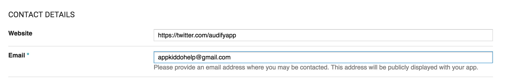
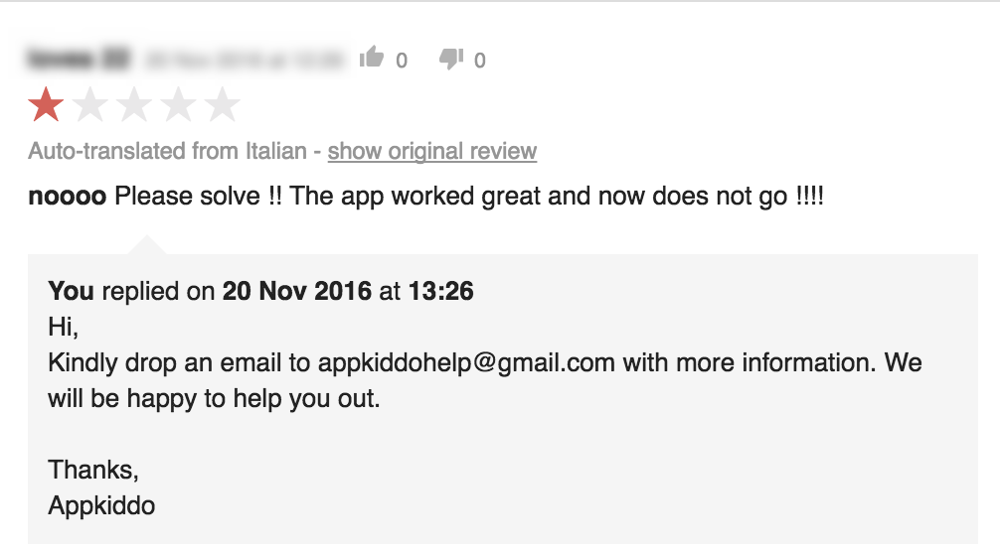
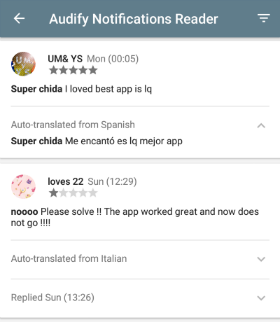
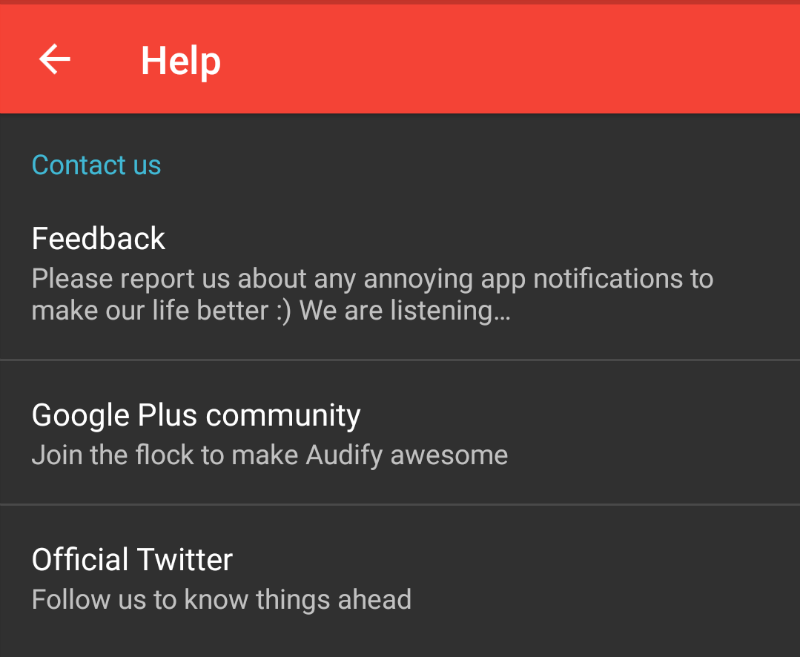
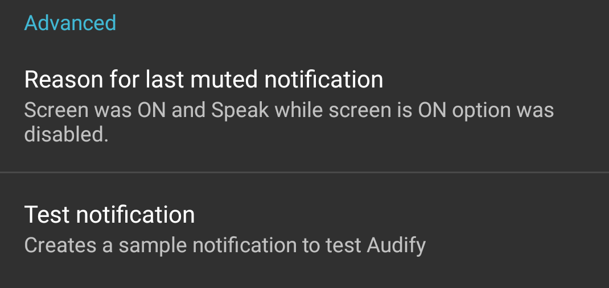
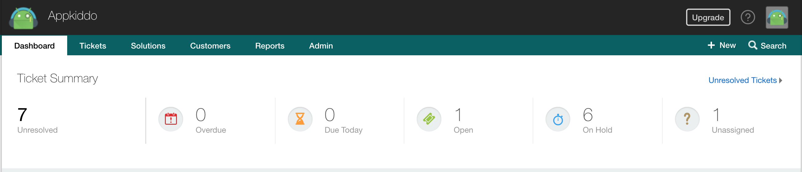

---

layout: post
firstPublishedAt: 1480243542905
latestPublishedAt: 1480283571392
slug: first-class-app-support-by-indie-developers
title: First class app support is possible by Indie developers

---

App support is one of the important aspect of every app. But it is often overlooked by indie developers due to time, effort and cost. Even big companies fail to notice the importance of app support.

### App support is a right of every user just like the guarantee of a product that we buy in a store.

It re-assures the customer and encourages to make a purchase.

Let’s look at the possible ways to provide app support as an indie dev. I present the strategies that I have adapted over the past one year with [Audify Notification Reader](https://play.google.com/store/apps/details?id=in.codeseed.audify) and would love to hear from others to improve it.

#### Playstore support email

Playstore lets every app to provide a support email for users to contact. It is visible on the app listing page through which the user can drop an email. So make sure that you provide a valid email address and monitor it frequently. But it is not good enough for every user to easily find it.

#### Playstore reviews

Playstore reviews are a great way for users to express their opinion about an app. Often, users rate apps with one star and ask for support in a hope that developers would take it seriously. So it’s good to constantly monitor the play store reviews and reply. Most of the users genuinely update their reviews once they get help.

[Google Play Console](https://play.google.com/store/apps/details?id=com.google.android.apps.playconsole) android app makes it extremely easy to do this with push notifications for every new app review or an update to an existing review. It even translates the reviews from other languages to English. Just few glances a day on your free time would be good enough.

#### Provide a way to contact support via the app

Add an option to contact developer in app settings (Eg: Email, Google plus community, twitter handle etc). Most of the apps follow this and makes it the obvious place for the users to look at. Incase of errors, try to provide a contextual feedback option to help users easily send their feedback. We can pre fill the feedback with any logs that would help us to analyse and solve the issues quickly.

#### Eagerly solve the issues

Provide tips to address common issues without going through the support. A good example would be adding tutorials to address connectivity issues. Audify has an option to inform users when it skips a notification due to a configuration. It decreased lot of support emails related to Audify skipping a notification.

#### Equip with better tools

Audify had a free promotion at the start of Jan 2016 and it offered the unlimited version for free on a specific day. Unfortunately, the logic behind it failed miserably and I had loads of emails complaining about it and also lot of one star reviews in Play store. Everyone was expecting an immediate reply and it was overwhelming for me to keep track of everyone and respond. It made me to look for better solutions.

**Helpdesk** solutions are really a better way to handle app support. Just setup and forward your support emails to your preferred helpdesk solution. It will automatically create tickets and lets you handle every customer at ease. But it depends on how affordable they are. I have opted for [Freshdesk](https://freshdesk.com/). It offers free service upto 3 agents and you pay for every additional agent which fits very well with indie developers. As you grow, you can scale your helpdesk as well. But feel free to look at different helpdesk solutions and choose the one that fits you.

Do share your feedback and help every indie developer provide **first class app support**.
