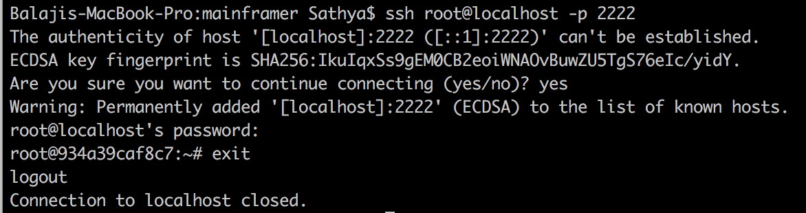

---

layout: post
firstPublishedAt: 1489316316547
latestPublishedAt: 1565790505634
slug: speed-up-android-builds-with-mainframer-docker-container-in-a-powerful-remote-machine
title: Speed-up Android builds with Mainframer (Docker container in a powerful remote machine)

---

My 13" Mac book Pro takes **~4 mins** for a clean gradle build of an android app at work, But my colleague’s powerful desktop machine takes only **~50 secs** for the same clean debug build. What if I can borrow some processing power from my colleague’s machine to make my builds? That’s the idea behind [Mainframer](https://github.com/gojuno/mainframer). If this interests you then buckle up and grab a ☕ to go through setup of mainframer


# Mainframer

[Mainframer](https://github.com/buildfoundation/mainframer) is an open source project on github. It syncs your project with a remote machine, runs a given gradle command and syncs the output back to local machine. Mainframer is just a shell script with few [properties format](https://en.m.wikipedia.org/wiki/.properties) files for configuration. It is totally independent of your android project and requires no change in your production code or project structure.

# Setting up remote machine

Remote machine needs an SSH server running to let local machine communicate and rsync to sync files. I prefer to keep the remote build system completely isolated from my colleague’s machine. This makes it should be easy to move or replicate to another system so that I don’t need to configure it again if needed.

#### Build docker container

[Docker](https://www.docker.com/) is the perfect fit for this purpose. It is light-weight, completely isolated container from the host machine and allows you to create identical copies quickly.

Download and install Docker on your machine. Once you start docker, you can see a whale icon on your status bar which indicates the status of Docker. Next step is to create a docker container with the appropriate tool set. A docker container is created with a docker image which can be built using a “Dockerfile”. Dockerfile is a plain text configuration file with docker commands to install the necessary software with necessary configurations. I have created a [Dockerfile for mainframer](https://gist.github.com/balachandarlinks/3a470e2667692e3000bffbeb487d9759) remote build system with android build tools, SSH server and rsync on ubuntu by referencing an android build system [dockerfile](https://github.com/appunite/docker/blob/master/android-java7-8-r25-0-1/Dockerfile) and ubuntu-ssh server [dockerfile](https://github.com/rastasheep/ubuntu-sshd/blob/master/16.04/Dockerfile). It is highly self-explanatory and you can easily go through the Dockerfile and add/remove commands as you prefer.

Let’s create a docker image for the remote build system. Create a new directory and place the mainframer Dockerfile inside and copy this [tools](https://github.com/appunite/docker/tree/master/android-java7-8-r25-0-1/tools) directory as well which helps with accepting android license agreements automatically. Move inside that directory and run the following command,

```
$docker build -t <tag_name_of_your_image> .
```

In the above command, please note that dot (“.”) at the end of the command refers to the current directory so that docker looks for the Dockerfile in the current directory. This command will create a docker image of our remote build system on successful completion.

Run the command below,

```
$docker images
```

to list the available images. You should be able to see the image that we just built.


Let’s instantiate a docker container with this image,

```
$docker run --name “name-of-container" -d <image-name>
```

This will instantiate a new docker container with the given name in detached mode and the command will complete immediately. You can verify it by typing

```
$docker ps
```


Let’s manage our docker container with a software called [Kitematic](https://kitematic.com/) which lets you control your docker containers via GUI(Graphical User Interface). Right click the docker whale icon on your menu bar and select Kitematic. It will prompt you to install on the first time and will open Kitematic once you have installed it.

You should be able to see the container that we just initiated. Select the container, click settings and setup the port for the host machine through which the host machine will redirect incoming connections to the ssh server running inside our docker container.


Glad that you are still with me :) We have completed the setup of our remote build machine with a docker container which is waiting to receive commands.

#### Testing the Docker container

We can verify it in the host machine. Run the following command,

```
$ssh root@localhost -p <host_port_that_forwards_to_docker_container>
```



Note: Default username/password of our remote build machine is root/root. This can be modified in the mainframer Dockerfile.

The command above should ask for the root password. Once you enter the correct password, we should be able to login into our docker container.

Incase of connection errors, Please verify that you are able to ping the remote machine. In my case, I had to add rules to the windows firewall to allow my host port for communication.

# **Setting up local machine**

The local machine needs an **SSH client** to communicate and **rsync** to sync files. You can verify it by typing “ssh” in a shell. Install rsync if it is not available. Now we need to setup SSH login credentials by sharing the public key of the local machine to remote machine to connect without entering password. So that mainframer can connect to the remote machine without prompting us to enter password every time.

#### Creating SSH keys

```
$ssh-keygen -t rsa
```

The command above will create a public key and private key in ~/.ssh directory.

#### Copying SSH key to remote

Let’s copy the SSH public key to remote machine,

```
$ssh-copy-id root@<ip_address_of_remote_machine> -p <host_port_that_forwards_to_docker_container>
```

If you don’t have ssh-copy-id tool then you can install it via brew.

```
$brew install ssh-copy-id
```

Once we copy our public key to remote machine, Try to login to remote machine again.

```
$ssh root@<ip_address_of_remote_machine> -p <host_port_that_forwards_to_docker_container>
```

We should be able to log in without entering the password as the remote machine is already aware of our ssh public key. So, we have completed the setup of our communication between local machine and remote machine and are now left with adding mainframer to our android project.

# **Adding Mainframer to android project**

It is very easy to add mainframer to the project. Copy [mainframer.sh](https://github.com/gojuno/mainframer/blob/development/mainframer.sh) from the repo and place it your project’s root directory. Create a new directory named as “.mainframer” in your project’s root directory and add the property files namely config, ignore, localignore and remoteignore. Refer [here](https://github.com/gojuno/mainframer/blob/development/docs/CONFIGURATION.md) for more information about this configuration files.

Note: config file has a property called remote_machine which takes the host name configured in your ~/.ssh/config file.

You can find a sample of ~/.ssh/config [here](https://github.com/gojuno/mainframer/blob/development/docs/SETUP_LOCAL.md) like below,

```
`Host <REMOTE_MACHINE_NAME>
  User <REMOTE_MACHINE_USERNAME>
  HostName <REMOTE_MACHINE_IP_OR_HOSTNAME>
  Port 22
  IdentityFile ~/.ssh/<SSH_KEY_NAME>
  PreferredAuthentications publickey
  ControlMaster auto
  ControlPath /tmp/%r@%h:%p
  ControlPersist 1h`
```

We are all set with the configurations. Now we can see mainframer in action,

```
$bash ./mainframer.sh ./gradlew assembleDebug
```

Any gradle task (Eg: testDebugUnitTest, checkstyle etc) can be executed by prefixing “bash ./mainframer.sh ” to it.

**Note**: I have faced an issue in my colleague’s mac while trying to login after copying the public key. It was complaining,

```
@@@@@@@@@@@@@@@@@@@@@@@@@@@@@@@@@@@@@@@@@@@@@@@@@@@@@@@@@@@
@         WARNING: UNPROTECTED PRIVATE KEY FILE!          @
@@@@@@@@@@@@@@@@@@@@@@@@@@@@@@@@@@@@@@@@@@@@@@@@@@@@@@@@@@@
```

Checkout [this post](http://apple.stackexchange.com/questions/18458/password-dialog-appears-when-ssh-private-key-permissions-are-set-to-0600) which fixed it for me. In short,

```
`
# Add the new public key to your mac's keychain
$ssh-add -K`
```

#### **Setting up environment variables in remote machine**

Mainframer runs the commands in a non-interactive shell inside remote machine. So it is important to setup our environment variables (ANDROID_HOME, JAVA_HOME, JAVA7_HOME and JAVA8_HOME) that are available in the non-interactive shell.

Run the command below to check the available environment variables,

```
$ssh <REMOTE_MACHINE_NAME> env
```

Following environment variables should be added to ~/.bashrc file.

```
export ANDROID_HOME=/opt/android-sdk-linux
export JAVA8_HOME=/usr/lib/jvm/java-8-oracle
export JAVA7_HOME=/usr/lib/jvm/java-7-oracle
```

_Important:_ It needs to be on the top of ~/.bashrc file before the following check which will skip everything after that for non-interactive shell,

```
# If not running interactively, don't do anything
[ -z "$PS1" ] && return
```

I have added the environment variables to the Dockerfile, so that you don’t need to do this manually ;)

#### Sample Execution

```
balachandar.k$ bash ./mainframer.sh ./gradlew assembleDebug
:: mainframer v2.1.0

Sync local → remote machine...
Sync done: took 0 seconds.

Executing command on remote machine…

./gradlew assembleDebug

To honour the JVM settings for this build a new JVM will be forked. Please consider using the daemon: [https://docs.gradle.org/2.14.1/userguide/gradle_daemon.html](https://docs.gradle.org/2.14.1/userguide/gradle_daemon.html).
Incremental java compilation is an incubating feature.
:app:preBuild UP-TO-DATE
:app:preDebugBuild UP-TO-DATE
:app:checkDebugManifest
:app:preReleaseBuild UP-TO-DATE
:app:prepareComAndroidSupportAnimatedVectorDrawable2520Library UP-TO-DATE
:app:prepareComAndroidSupportAppcompatV72520Library UP-TO-DATE
:app:prepareComAndroidSupportSupportCompat2520Library UP-TO-DATE
:app:prepareComAndroidSupportSupportCoreUi2520Library UP-TO-DATE
:app:prepareComAndroidSupportSupportCoreUtils2520Library UP-TO-DATE
:app:prepareComAndroidSupportSupportFragment2520Library UP-TO-DATE
:app:prepareComAndroidSupportSupportMediaCompat2520Library UP-TO-DATE
:app:prepareComAndroidSupportSupportV42520Library UP-TO-DATE
:app:prepareComAndroidSupportSupportVectorDrawable2520Library UP-TO-DATE
:app:prepareDebugDependencies
:app:compileDebugAidl UP-TO-DATE
:app:compileDebugRenderscript UP-TO-DATE
:app:generateDebugBuildConfig UP-TO-DATE
:app:generateDebugResValues UP-TO-DATE
:app:generateDebugResources UP-TO-DATE
:app:mergeDebugResources UP-TO-DATE
:app:processDebugManifest UP-TO-DATE
:app:processDebugResources UP-TO-DATE
:app:generateDebugSources UP-TO-DATE
:app:incrementalDebugJavaCompilationSafeguard UP-TO-DATE
:app:compileDebugJavaWithJavac UP-TO-DATE
:app:compileDebugNdk UP-TO-DATE
:app:compileDebugSources UP-TO-DATE
:app:mergeDebugShaders UP-TO-DATE
:app:compileDebugShaders UP-TO-DATE
:app:generateDebugAssets UP-TO-DATE
:app:mergeDebugAssets UP-TO-DATE
:app:transformClassesWithDexForDebug UP-TO-DATE
:app:mergeDebugJniLibFolders UP-TO-DATE
:app:transformNative_libsWithMergeJniLibsForDebug UP-TO-DATE
:app:processDebugJavaRes UP-TO-DATE
:app:transformResourcesWithMergeJavaResForDebug UP-TO-DATE
:app:validateSigningDebug
:app:packageDebug UP-TO-DATE
:app:assembleDebug UP-TO-DATE

BUILD SUCCESSFUL

Total time: 3.825 secs

Execution done: took 4 seconds.

Sync remote → local machine…
Sync done: took 1 second.

Success: took 5 seconds.
```

# Results

**Local:**
Macbook Pro 13" — Early 2015–2.7 GHz Intel Core i5–8 GB 1867 MHz DDR3 RAM
_~3 mins_

**Remote**:
Desktop — 32GB ram — Intel Core I7 6700K — SSD 512GS Samsung 960 Pro
Mainframer Docker Container (Android build tools on Ubuntu)- Allowed 4 cores and 12 GB RAM
_~ 40 secs_

You can notice that the docker container builds faster(~40 secs) than my colleague’s host machine(~50 secs) running windows! It definitely saves at-least 30 mins a day at work which is highly valuable. A better build system would be the permanent solution to reduce build time(Improved gradle, Buck or Bazel!). But Mainframer would be a nice add-on in any case to reduce build time and to work with low power machines.

# Bonus

Check [this](https://github.com/gojuno/mainframer/blob/development/recipes/INTELLIJ_RUN_CONFIG.md) to configure Mainframer run actions with Android Studio. There is also a Mainframer [plug-in](https://github.com/elpassion/mainframer-intellij-plugin) available for Android Studio.

Hope you have enjoyed this blog post. Thanks to [Juno](https://github.com/gojuno) for Mainframer. Please share your feedback in comments.

Checkout my other blogposts below,

1. [Audify — Idea to app in 90 days Part I](https://medium.com/@balachandarkm/audify-version-1-0-idea-to-app-in-90-days-part-i-e33faa1e11c7#.ccli1kgfd)

1. [Audify — Idea to app in 90 days Part II](https://medium.com/@balachandarkm/audify-version-1-00-idea-to-app-in-90-days-4d7be2393848#.bwlm9ocsf)

1. [The potential of a simple bug in Twitter’s android app](https://medium.com/@balachandarkm/the-potential-of-a-simple-bug-in-twitter-s-android-client-9299545d542d#.5t710nfvx)

1. [First class app support is possible by Indie developers](https://medium.com/@balachandarkm/first-class-app-support-by-indie-developers-2c9a4598df96#.la4z92x09)

Update 22-Mar-2017: Added a fix to the blog post for a common issue faced in my colleagues’ mac while setting up the ssh public key.

Update 30-Mar-2017: Added a new section on setting up environment variables and also updated the Dockerfile to setup the environment variables while building the image.
